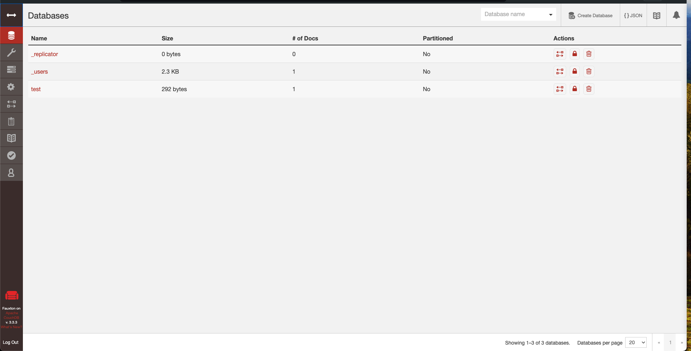

# CouchDB

Apache CouchDB is an open-source NoSQL database that uses JSON to store data. It is a distributed, fault-tolerant, and
schema-free document-oriented database that is accessible through a RESTful HTTP/JSON API. CouchDB is written in Erlang
and is available on multiple platforms.

## Prerequisites

- Docker
- Docker Compose

## Running the Stack

### Standalone

Inside `standalone` directory, run `docker-compose up` to start the connector.

#### Port Configurations

- `5984` - CouchDB REST API

## Configurations

All the configurations are available in folder `standalone/config/local.ini`.

Default authentication credentials:
- Username: `admin`
- Password: `password`
- Secret: `secret`

## CouchDB Fauxton

CouchDB comes with a built-in administration interface called Fauxton. It is a web-based interface that allows you to
manage your CouchDB instance. You can access Fauxton by visiting [http://localhost:5984/_utils/](http://localhost:5984/_utils/) in your browser.

