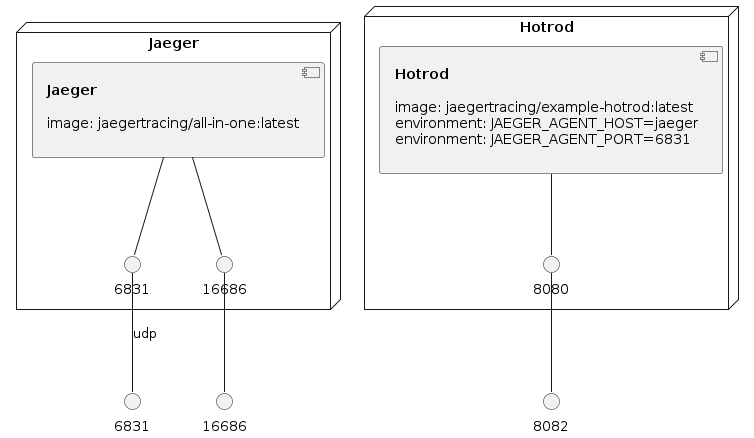

# Jaeger

This docker compose setup starts Jaeger and hotrod services.

To start the service run:

```console
docker compose up

use -d option to start the services in detached mode
```

### Ports
Below Ports are exposed by the services, you can always change them according to your need in the yml
[here](https://github.com/ninadingole/docker-images/blob/a423f995b3388320df1c9a3b404694ff7a1aad13/jaeger/docker-compose.yml#L1)

| Port   | Description       |
|--------|-------------------|
| 6831   | Jaeger Agent Port |
| 16686  | Jaeger UI Port    |
| 8082   | Hotrod UI Port    |

### Infrastructure model




