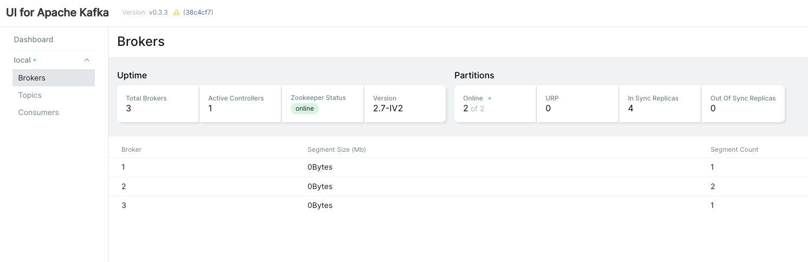

## Apache Kafka cluster

This docker compose provides 3 broker nodes and 1 zookeeper node Kafka Cluster.
This helps to test Kafka application on local instead of a real cluster.

The configurations are bare minimum to start the server and could be changed based on requirement

There is also a Kafka UI application available at http://localhost:8080



### How to start
    
```bash
docker-compose up

use -d to run in detached mode
```
> If you don't see changes to the cluster after updating the yml, try doing
> `docker compose down` and then start the cluster again.

### Port Mapping
| Port | Description             |
|------|-------------------------|
| 2181 | Zookeeper               |
| 9092 | Kafka Broker 1          |
| 9093 | Kafka Broker 2          |
| 9094 | Kafka Broker 3          |
| 8080 | Kafka UI                |
| 1099 | JMX PORT on all brokers |


