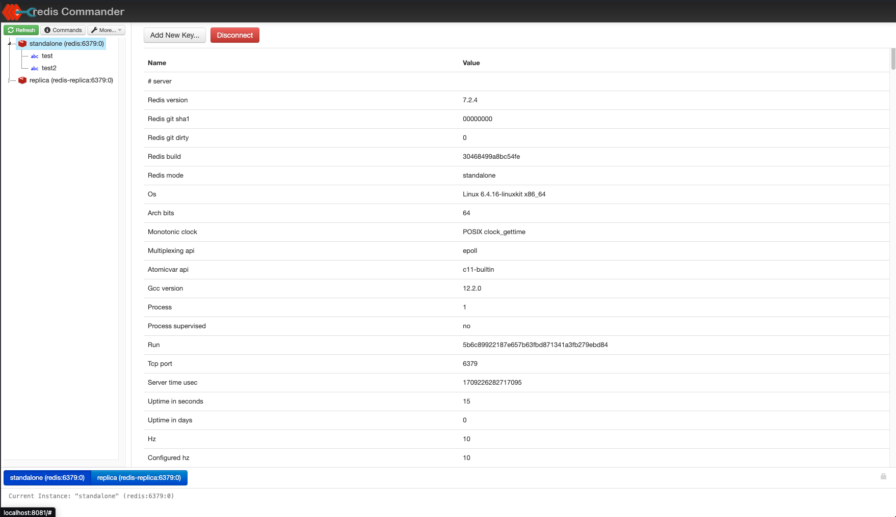

# Redis
Redis is a versatile and fast data store that supports strings, hashes, lists, sets, streams, and more. It also offers programmability, extensibility, persistence, clustering, and high availability features, as well as Redis Stack for modern data models and processing engines.

# Management UI
Redis Commander is a web-based management tool for Redis. It is a simple and intuitive tool that allows you to interact with Redis, monitor key space, and execute commands.

Navigate to http://localhost:8081 to access the Redis Commander UI.

## Prerequisites
- Docker
- Docker Compose

## Running the Stack

### Standalone

Inside the `standalone` directory, run `docker-compose up` to start the connector.

### Port Configurations

- `6379` - Master Redis port
- `6380` - Slave Redis port

### Configuration

All the configurations are available in the `standalone/conf` directory.

- `redis.conf` - Master Redis configuration file
- `redis-replica.conf` - Replica Redis configuration file
- `redis-commander.json` - Redis Commander configuration file

### Data Persistence

- `standalone/data` - Master Redis data directory
- `standalone/data-replica` - Replica Redis data directory

