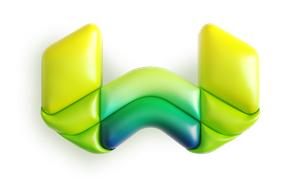

# Weaviate

Weaviate is a cloud-native, modular, real-time vector search engine. It is based on the concept of a knowledge graph,
which allows you to interact with your data through a GraphQL API. Weaviate is open-source and can be deployed
on-premise or in the cloud.

## Prerequisites
- Docker
- Docker Compose

## Running the Stack

### Standalone

Inside the directory, run `docker-compose up` to start the connector.

### Port Configurations

- `8080` - Weaviate REST API
- `50051` - Weaviate gRPC API

## Test the Stack

Inside the `client` directory, run `go run main.go` to test the Weaviate REST API.
more information on how to run the client can be found in the [client](./client/README.md) directory.
